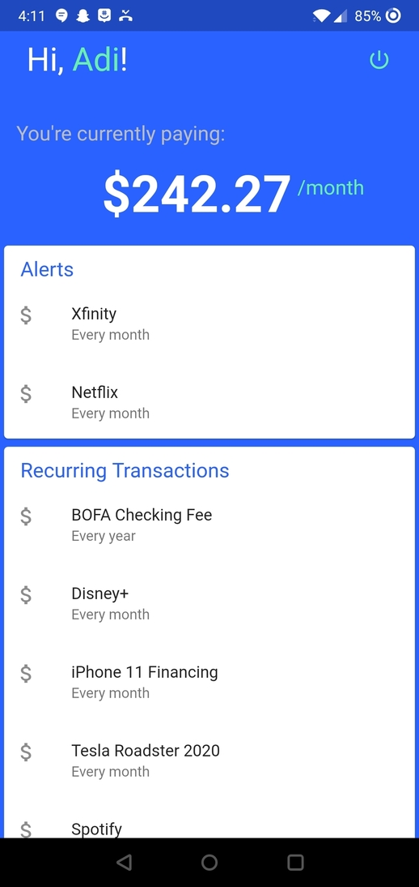

# RecurTrac

This is a project my team and I made at a hackathon at Virginia Tech 
for the Capital One tech challenge  
## Concept
A mobile app to track recurring payments on your bank statement.
Built with Flutter, Google App Engine, and Go.

## Needs the following project to work 
> https://github.com/IYZaytsev/VThacks-Backend

  

